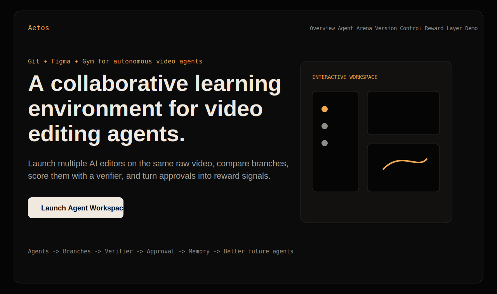
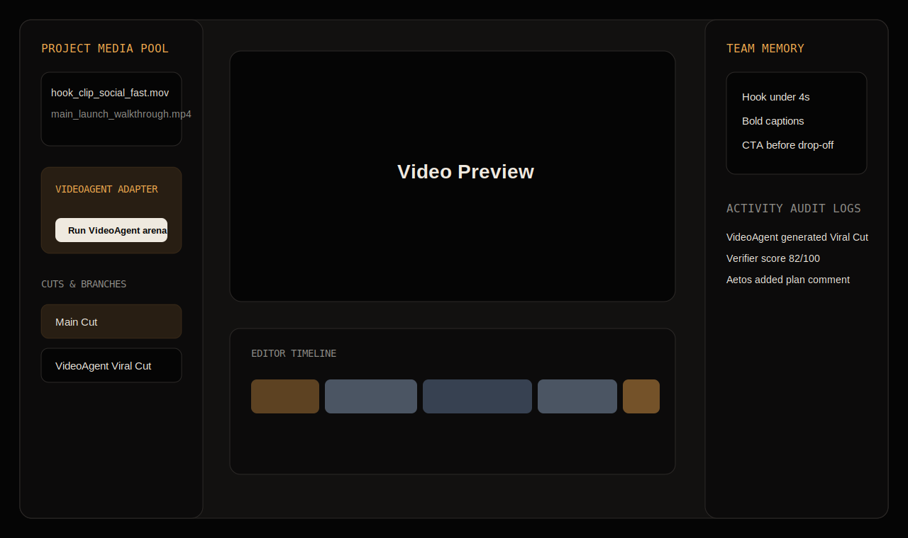
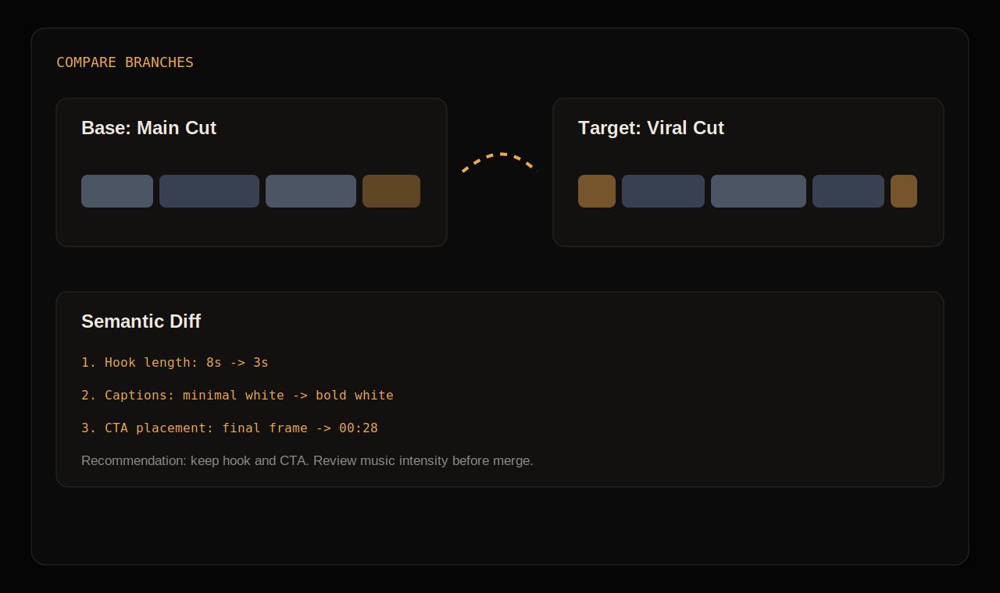
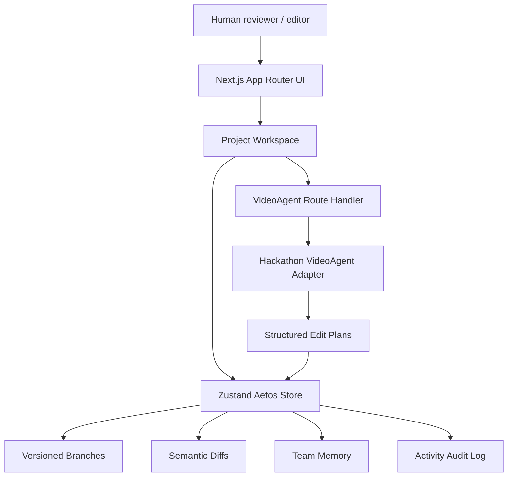
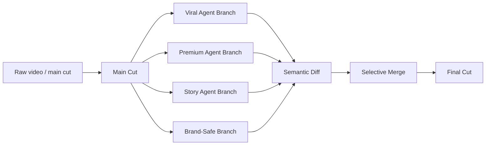
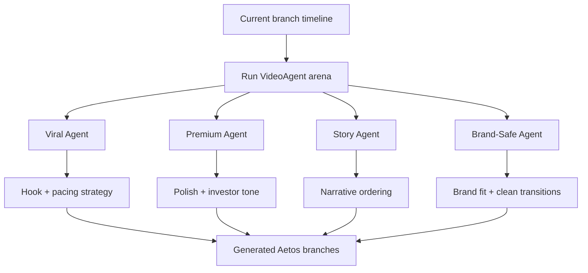
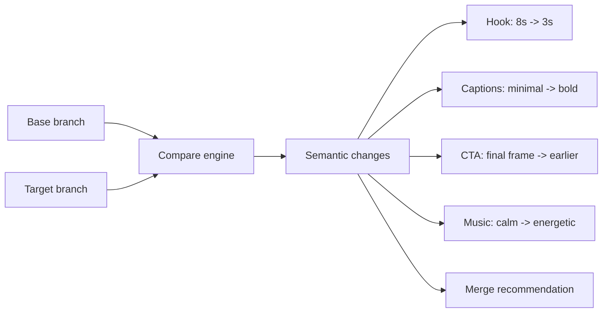
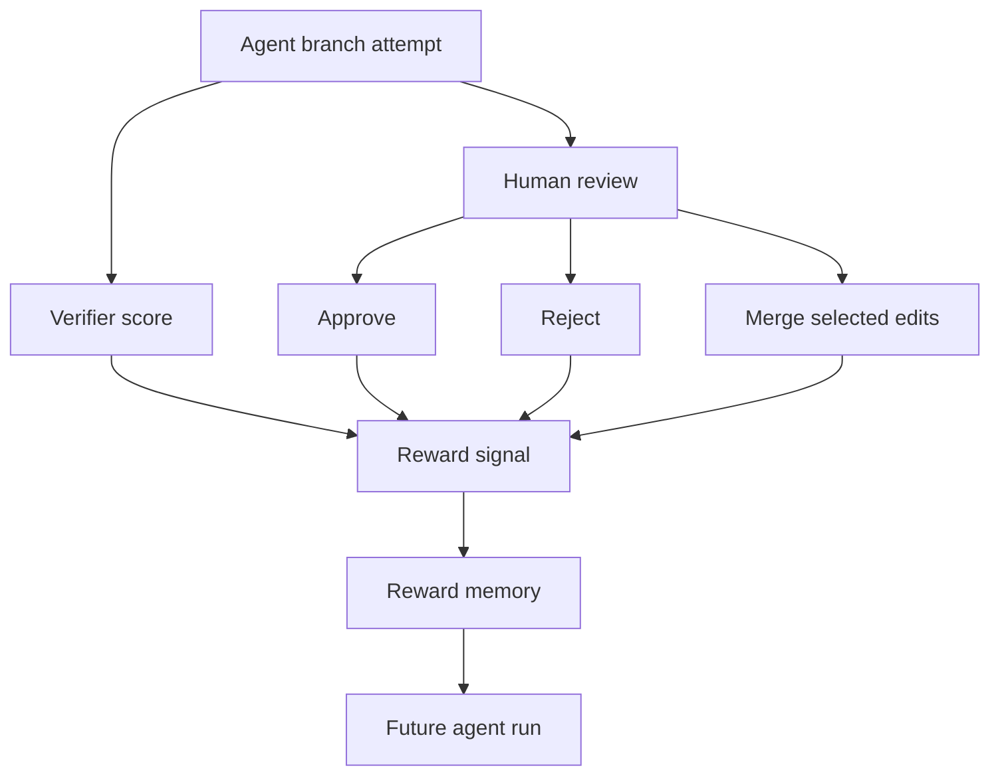
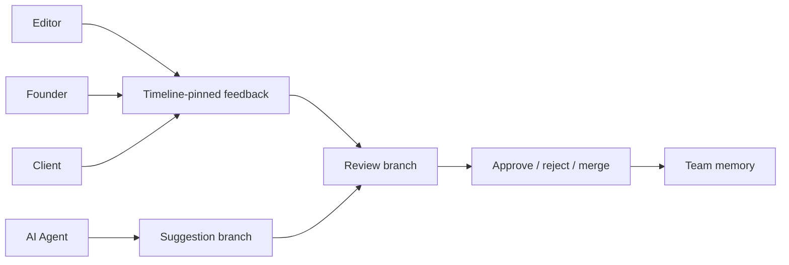
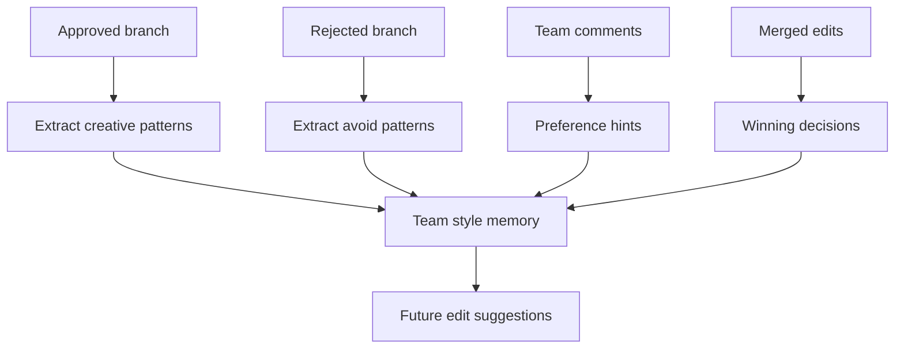

# Aetos

> A collaborative, version-controlled, RL-ready workspace for autonomous video editing agents.

Aetos is **Git + Figma + Gym for video agents**.

- **Git**: every agent edit becomes a versioned branch.
- **Figma**: humans and agents collaborate in one shared workspace.
- **Gym**: verifier scores, approvals, rejections, and merges become reward signals for future agents.

This repo is a hackathon MVP. It does **not** claim to train a full RL model yet. It creates the environment where video agents can try edit actions, receive verifier/human feedback, and turn approved decisions into reusable memory.

## Product Loop

```text
Agents create branches
        |
Aetos compares versions
        |
Verifier scores them
        |
Team approves / rejects / merges
        |
Approvals become memory + reward signals
        |
Future agents improve
```

## Demo

```powershell
cd "C:\Users\Mani Varshith\Aetos"
npx pnpm@10.14.0 dev
```

Open the local URL printed by Next.js, usually:

```text
http://localhost:3000
```

If that port is busy, Next.js may use `3001` or `3002`.

## App Navigation

| Screen | Route | Main Actions |
| --- | --- | --- |
| Landing page | `/` | `Launch Agent Workspace`, `Run Agent Arena`, review product story |
| Dashboard | `/dashboard` | Open the YC launch project |
| Agent workspace | `/project/project-yc-launch` | `Run VideoAgent arena`, create branches, select cuts, view memory |
| Compare view | `/project/project-yc-launch/compare?base=...&target=...` | Compare semantic diffs between branches |
| Embedded editor | `/editor/project-yc-launch` | Open the OpenCut-based editing surface |
| VideoAgent API | `/api/agents/videoagent/run` | Generate hackathon agent branch plans |

## Screenshots / Navigation Map

These SVGs are lightweight screenshot-style maps of the current app flow. Replace them with live captures when preparing a submission deck.

### Landing Page



### Agent Workspace



### Compare Branches



## Button-Level Demo Script

### 1. Landing Page

Start at `/`.

`Launch Agent Workspace`

Opens the YC startup launch project. This is the fastest path into the working demo.

`Run Agent Arena`

Explains the central concept: multiple autonomous editing agents compete and collaborate by creating different branches.

### 2. Project Workspace

Open `/project/project-yc-launch`.

`+ new cut`

Creates a manual branch from the current branch. This demonstrates Aetos version control for human editors.

`Run VideoAgent arena`

Calls the hackathon VideoAgent adapter. It generates four branches from the current cut:

- `VideoAgent Viral Cut`
- `VideoAgent Premium Cut`
- `VideoAgent Story Cut`
- `VideoAgent Brand-Safe Cut`

Each generated branch is stored as a real Aetos branch, added to the sidebar, logged in the activity feed, and annotated with a summary comment.

`Compare`

Opens a semantic diff view between the current branch and another branch.

### 3. Compare View

Use this to show that Aetos compares **creative decisions**, not just files.

Examples:

- hook shortened
- CTA moved earlier
- captions changed
- music changed
- clip order changed
- brand tone shifted

### 4. Memory / Reward Loop

Approving a branch updates team memory. In the MVP this is heuristic memory, not full RL training.

Current honest framing:

```text
Aetos is RL-ready.
It captures attempts, scores, approvals, rejections, comments, and merges.
Those signals can become rewards for future editing agents.
```

## Hackathon VideoAgent Integration

The real `HKUDS/VideoAgent` project is a Python ML/agent system with model/runtime requirements. For hackathon speed, Aetos integrates it through a stable adapter boundary instead of installing the full Python stack inside the Next.js app.

Current implementation:

```text
Project workspace button
        |
POST /api/agents/videoagent/run
        |
src/lib/videoagent-adapter.ts
        |
Structured edit plans
        |
createAgentBranch()
        |
Aetos branches + activity + comments
```

The adapter returns:

- agent type
- branch name
- verifier score
- summary
- recommendation
- edit actions
- generated timeline

Later, `/api/agents/videoagent/run` can call a Python VideoAgent worker instead of the local mock adapter.

## Architecture



## Whiteboard: Version Control



Version control gives Aetos the creative decision history:

- what was tried
- what changed
- what worked
- what failed

## Whiteboard: Agent Arena



The important product message: Aetos is not a single AI editor. It is an arena where multiple agents explore different creative strategies.

## Whiteboard: Semantic Diff



Aetos translates edit changes into plain language instead of forcing teams to review five exported files manually.

## Whiteboard: Reward Layer / RL-Ready Loop



Current MVP:

- verifier score is heuristic/demo-grade
- approval memory is implemented
- real RL training is not implemented yet

Future real reward function:

```ts
reward =
  0.25 * hookScore +
  0.20 * pacingScore +
  0.15 * captionScore +
  0.15 * brandFitScore +
  0.10 * ctaScore +
  0.10 * technicalQualityScore +
  0.05 * humanApprovalBonus;
```

## Whiteboard: Collaboration



Collaboration captures human judgment. Human judgment is the strongest signal for what the team actually wants.

## Whiteboard: Memory From Approvals



Memory is not manually written rules. In Aetos, memory is the pattern of creative decisions that repeatedly win approval.

## Important Files

| File | Purpose |
| --- | --- |
| `src/app/page.tsx` | Landing page and interactive marketing/demo mockup |
| `src/app/project/[projectId]/page.tsx` | Main agent workspace |
| `src/app/api/agents/videoagent/run/route.ts` | VideoAgent hackathon API boundary |
| `src/lib/videoagent-adapter.ts` | Structured mock VideoAgent planner |
| `src/lib/store.ts` | Branch, memory, comments, and activity state |
| `src/lib/diff-engine.ts` | Semantic diff engine |
| `src/lib/memory-engine.ts` | Approval-based memory extraction |
| `src/lib/three-way-merge.ts` | Three-way branch merge logic |

## Development

Install dependencies:

```powershell
npx pnpm@10.14.0 install
```

Run dev server:

```powershell
npx pnpm@10.14.0 dev
```

Build:

```powershell
npm run build
```

Run focused lint for the new integration:

```powershell
.\node_modules\.bin\eslint.cmd --no-ignore "src\app\project\[projectId]\page.tsx" src\lib\videoagent-adapter.ts src\app\api\agents\videoagent\run\route.ts src\lib\store.ts
```

## Environment Variables

Optional:

```text
FREESOUND_API_KEY=
```

If absent, the sound search API returns an empty result set instead of failing.

## What Aetos Is Not

Aetos is not a replacement for Premiere Pro, Final Cut Pro, CapCut, or DaVinci Resolve.

Aetos is the orchestration, version-control, collaboration, verifier, and learning layer around autonomous video editing agents.

## Status

Implemented:

- landing page repositioning
- interactive workspace story
- branch/version control model
- semantic diff engine
- memory-from-approval engine
- hackathon VideoAgent adapter
- VideoAgent API route
- branch generation from agent plans
- compare workflow

Not implemented yet:

- full Python VideoAgent worker
- real model inference
- real trainable RL loop
- persistent database
- production authentication

## License

Hackathon MVP. Add the final project license before wider open-source release.
