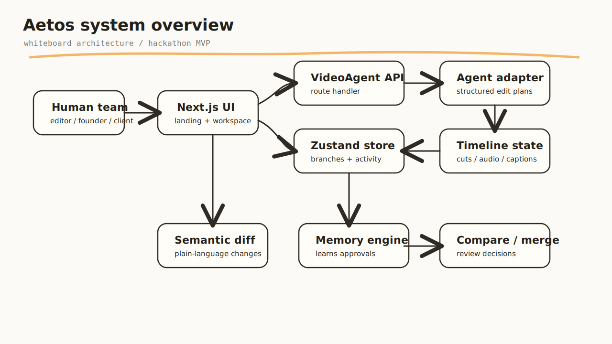
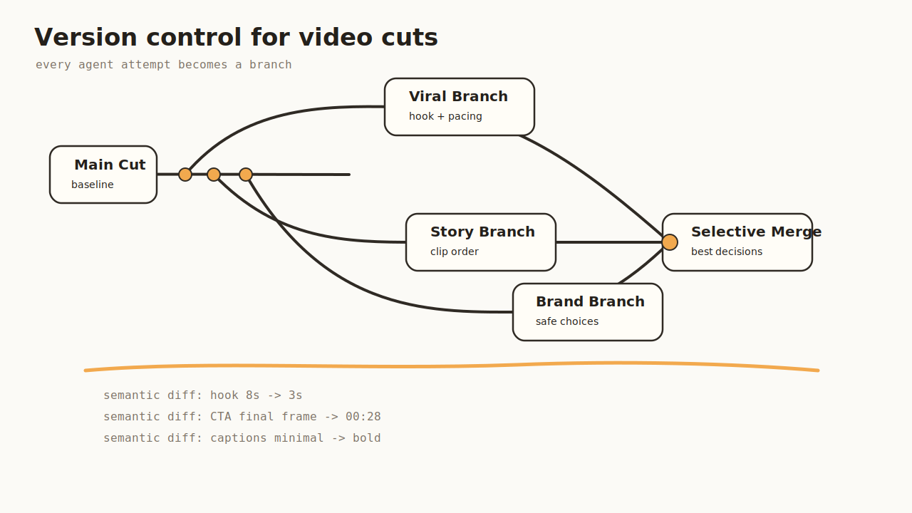
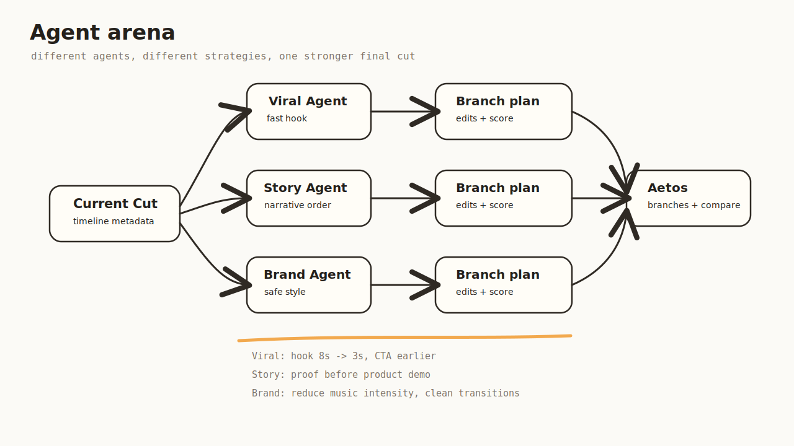
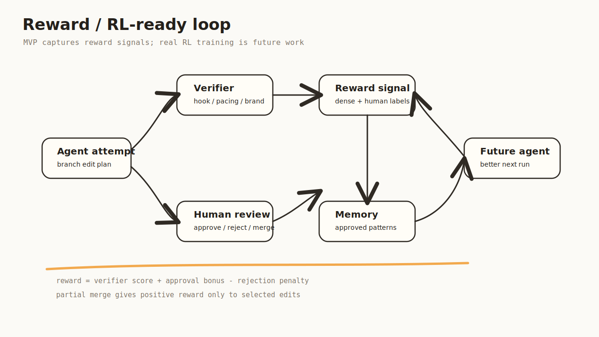
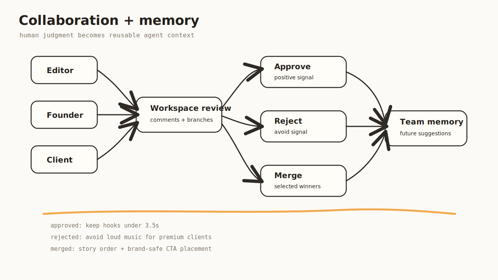

# Aetos

Aetos is a collaborative, version-controlled workspace for autonomous video editing agents.

```text
Git + Figma + Gym for video agents
```

- **Git** for versioned video branches.
- **Figma** for human and agent collaboration.
- **Gym** for verifier scores, approvals, rejections, and reward signals.

Aetos is not a replacement for Premiere Pro, Final Cut Pro, CapCut, or DaVinci Resolve. It is the orchestration layer around autonomous video editing agents: branching, comparing, scoring, reviewing, merging, and learning from approved creative decisions.

## Status

This is a hackathon MVP.

**Functional today**

- Next.js app and demo workspace
- branch creation and branch selection
- semantic diffing between cuts
- compare workflow
- merge and memory logic in code
- hackathon VideoAgent adapter API
- agent-generated branch plans
- activity logs and comments for generated branches

**Simulated today**

- real VideoAgent model execution
- real video understanding
- real verifier model
- real RL training
- persistent database
- rendered video export

Honest positioning:

```text
Aetos is an RL-ready environment for video editing agents.
It does not yet train a full RL editing model.
```

## Quick Start

```powershell
cd "C:\Users\Mani Varshith\Aetos"
npx pnpm@10.14.0 install
npx pnpm@10.14.0 dev
```

Open the local URL printed by Next.js:

```text
http://localhost:3000
```

If port `3000` is busy, Next.js will print another port such as `3001` or `3002`.

## Demo Flow

1. Open the landing page at `/`.
2. Click `Launch Agent Workspace`.
3. Open the YC launch project.
4. Click `Run VideoAgent arena`.
5. Aetos generates multiple agent branches: Viral, Premium, Story, and Brand-Safe.
6. Click `Compare` on a branch.
7. Review semantic differences.
8. Use the flow to explain approval, memory, and future reward signals.

Main demo route:

```text
/project/project-yc-launch
```

## App Routes

| Route | Purpose |
| --- | --- |
| `/` | Landing page and product story |
| `/dashboard` | Project list |
| `/project/project-yc-launch` | Main Aetos workspace |
| `/project/[projectId]/compare` | Branch comparison view |
| `/editor/[projectId]` | Embedded OpenCut editor |
| `/api/agents/videoagent/run` | Hackathon VideoAgent adapter endpoint |
| `/api/sounds/search` | Freesound search endpoint |

## Whiteboard Architecture

### System Overview



The UI, branch store, semantic diff engine, memory engine, and VideoAgent adapter are separated so the mock adapter can later be replaced by a real Python worker.

### Version Control



Version control records what each agent tried, what changed, what worked, and what failed.

### Agent Arena



Aetos is not a single AI editor. It is an arena where multiple agents explore different creative strategies in parallel.

### Reward / RL-Ready Loop



The current MVP captures the shape of an RL-ready environment. It does not yet run real RL training.

### Collaboration And Memory



Human approvals, rejections, comments, and merges become the strongest signal for future agent behavior.

## VideoAgent Integration

The current `VideoAgent` integration is a hackathon adapter.

It does **not** run the real Python `HKUDS/VideoAgent` stack yet. It returns structured branch plans that match the shape a real worker can provide later.

Current flow:

```text
Run VideoAgent arena
        |
POST /api/agents/videoagent/run
        |
src/lib/videoagent-adapter.ts
        |
Structured edit plans
        |
createAgentBranch()
        |
Aetos branches + activity + comments
```

## Reward Function Roadmap

Current verifier scores are heuristic/demo-grade. A future real reward function could look like:

```ts
reward =
  0.25 * hookScore +
  0.20 * pacingScore +
  0.15 * captionScore +
  0.15 * brandFitScore +
  0.10 * ctaScore +
  0.10 * technicalQualityScore +
  0.05 * humanApprovalBonus;
```

Potential labels:

- approved branch: positive branch-level reward
- rejected branch: negative branch-level reward
- partial merge: positive reward for selected edits
- comment on issue: negative reward for that category
- verifier score: dense heuristic reward

## Important Files

| File | Purpose |
| --- | --- |
| `src/app/page.tsx` | Landing page and product story |
| `src/app/project/[projectId]/page.tsx` | Main project workspace |
| `src/app/project/[projectId]/compare/page.tsx` | Branch comparison screen |
| `src/app/api/agents/videoagent/run/route.ts` | VideoAgent adapter API route |
| `src/lib/videoagent-adapter.ts` | Hackathon VideoAgent branch planner |
| `src/lib/store.ts` | Branch, comment, activity, and memory state |
| `src/lib/diff-engine.ts` | Semantic diff engine |
| `src/lib/memory-engine.ts` | Approval-based memory logic |
| `src/lib/three-way-merge.ts` | Merge logic |

## Development Commands

```powershell
npx pnpm@10.14.0 dev
```

```powershell
npm run build
```

Focused lint for the VideoAgent integration:

```powershell
.\node_modules\.bin\eslint.cmd --no-ignore "src\app\project\[projectId]\page.tsx" src\lib\videoagent-adapter.ts src\app\api\agents\videoagent\run\route.ts src\lib\store.ts
```

## Environment Variables

Optional:

```text
FREESOUND_API_KEY=
```

If absent, sound search returns an empty result set instead of crashing the editor.

## Roadmap

- Replace mock VideoAgent adapter with a Python worker.
- Add persistent project storage.
- Add real verifier scoring.
- Add real reward computation.
- Add rendered video export.
- Add auth and team workspaces.

## License

Add the final project license before public release.
