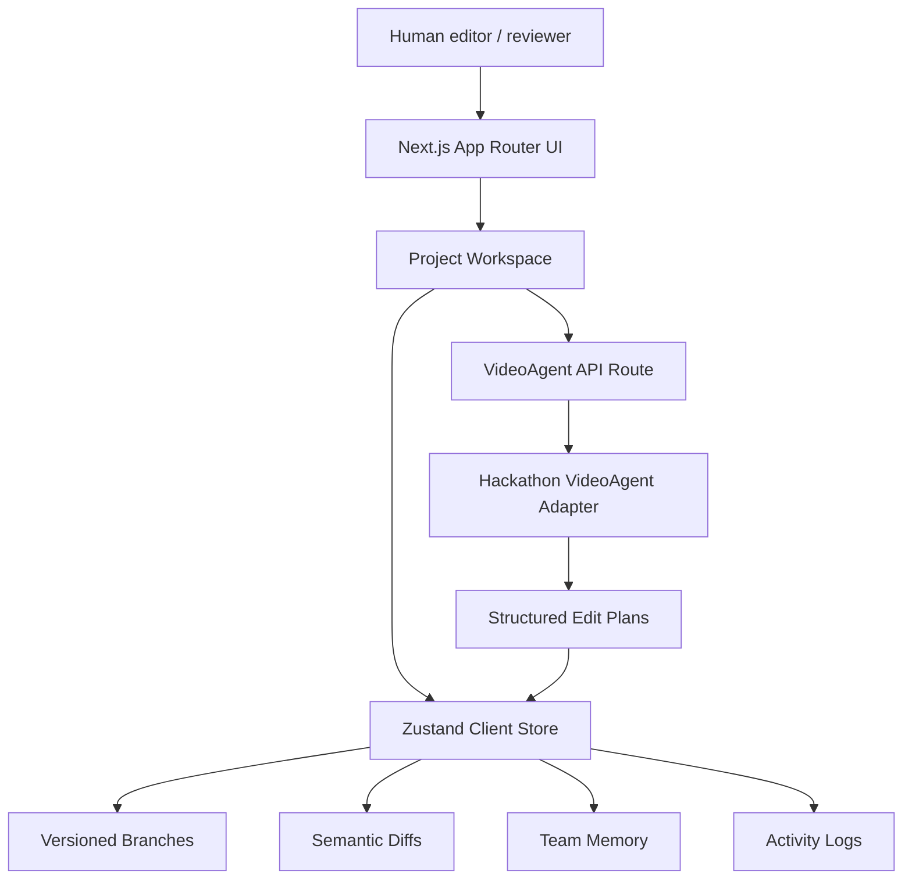
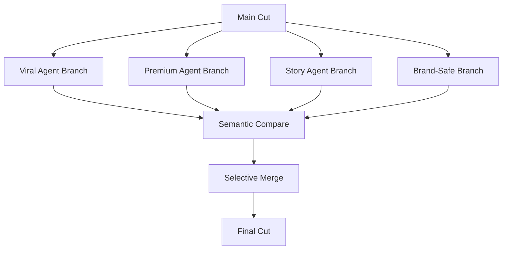
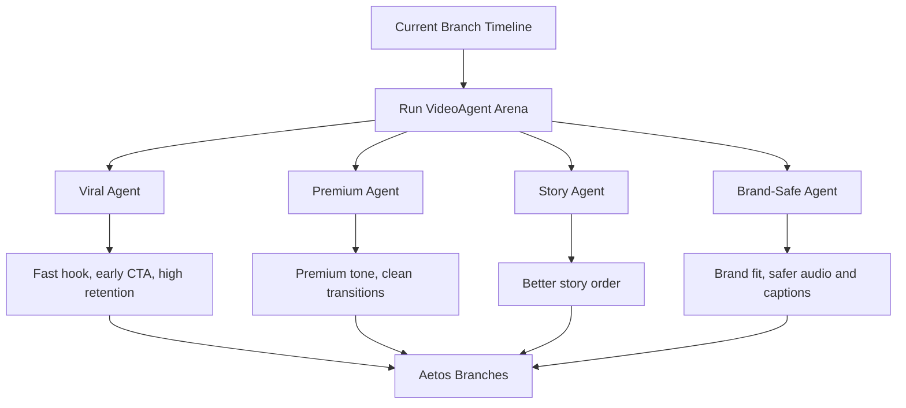
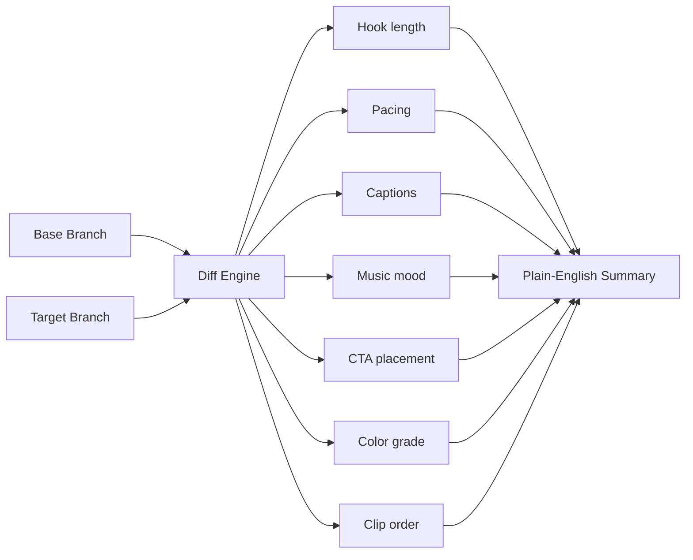
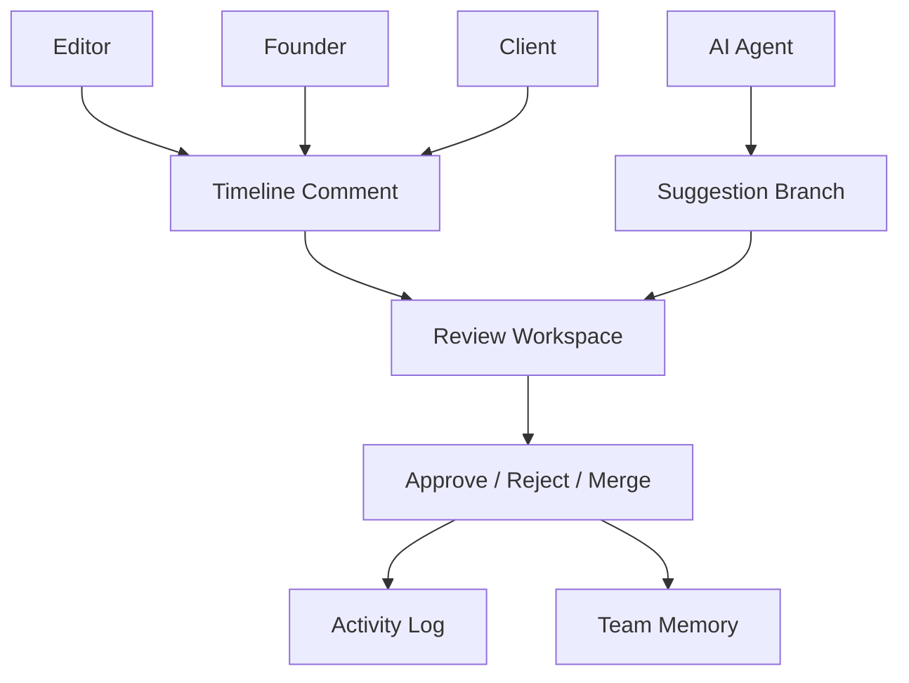
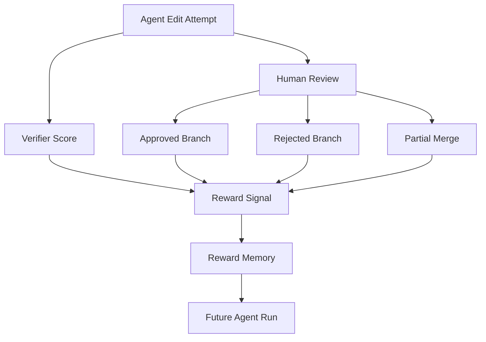
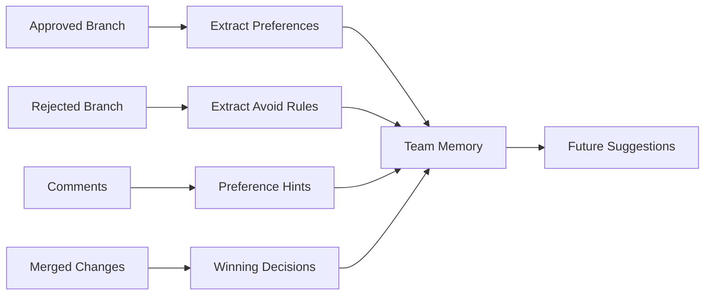

# Aetos

Aetos is a collaborative, version-controlled workspace for autonomous video editing agents.

It is best understood as:

```text
Git + Figma + Gym for video agents
```

- **Git** for versioned video branches.
- **Figma** for human and agent collaboration.
- **Gym** for verifier scores, approvals, rejections, and reward signals.

Aetos is not trying to replace Premiere Pro, Final Cut Pro, CapCut, or DaVinci Resolve. It is the orchestration layer around autonomous video editing agents: branching, comparing, scoring, reviewing, merging, and learning from approved creative decisions.

## Current Status

This is a hackathon MVP.

Functional today:

- Next.js app and demo workspace
- branch creation and branch selection
- semantic diffing between cuts
- compare workflow
- merge and memory logic in code
- hackathon VideoAgent adapter API
- agent-generated branch plans
- activity logs and comments for generated branches

Simulated today:

- real VideoAgent model execution
- real video understanding
- real verifier model
- real RL training
- persistent database
- rendered video export

Honest positioning:

```text
Aetos is an RL-ready environment for video editing agents.
It does not yet train a full RL editing model.
```

## Quick Start

```powershell
cd "C:\Users\Mani Varshith\Aetos"
npx pnpm@10.14.0 install
npx pnpm@10.14.0 dev
```

Open the local URL printed by Next.js:

```text
http://localhost:3000
```

If port `3000` is busy, Next.js will print another port such as `3001` or `3002`.

## Demo Flow

1. Open the landing page at `/`.
2. Click `Launch Agent Workspace`.
3. Open the YC launch project.
4. Click `Run VideoAgent arena`.
5. Aetos generates multiple agent branches:
   - Viral cut
   - Premium cut
   - Story cut
   - Brand-safe cut
6. Click `Compare` on a branch.
7. Review semantic differences.
8. Use the flow to explain approval, memory, and future reward signals.

Main demo route:

```text
/project/project-yc-launch
```

## App Routes

| Route | Purpose |
| --- | --- |
| `/` | Landing page and product story |
| `/dashboard` | Project list |
| `/project/project-yc-launch` | Main Aetos workspace |
| `/project/[projectId]/compare` | Branch comparison view |
| `/editor/[projectId]` | Embedded OpenCut editor |
| `/api/agents/videoagent/run` | Hackathon VideoAgent adapter endpoint |
| `/api/sounds/search` | Freesound search endpoint |

## System Architecture



## Product Loop

```mermaid
flowchart LR
  Raw[Raw video] --> Agents[Launch agents]
  Agents --> Branches[Create branches]
  Branches --> Diff[Compare semantic diffs]
  Diff --> Score[Verifier score]
  Score --> Review[Human review]
  Review --> Merge[Approve / reject / merge]
  Merge --> Memory[Memory + reward signal]
  Memory --> Next[Better future agent runs]
```



## Version Control Architecture



Version control records:

- what each agent tried
- which clips changed
- how the hook changed
- where the CTA moved
- how captions, audio, pacing, and brand tone shifted
- which decisions were approved or rejected

## Agent Arena Architecture



The current `VideoAgent` integration is a hackathon adapter. It does not run the real Python `HKUDS/VideoAgent` stack yet. It returns structured branch plans that match the shape a real worker can provide later.

## Semantic Diff Architecture



Instead of asking reviewers to inspect five exported files manually, Aetos explains what changed.

## Collaboration Architecture



Collaboration is the human feedback layer. The strongest signal is what the team actually approves, rejects, comments on, and merges.

## Reward / RL-Ready Architecture



Current MVP reward behavior is heuristic and simulated. A future real reward function could look like:

```ts
reward =
  0.25 * hookScore +
  0.20 * pacingScore +
  0.15 * captionScore +
  0.15 * brandFitScore +
  0.10 * ctaScore +
  0.10 * technicalQualityScore +
  0.05 * humanApprovalBonus;
```

## Memory Architecture



Memory is not just a notes database. In Aetos, memory is the pattern of creative decisions that repeatedly wins approval.

## Important Files

| File | Purpose |
| --- | --- |
| `src/app/page.tsx` | Landing page and product story |
| `src/app/project/[projectId]/page.tsx` | Main project workspace |
| `src/app/project/[projectId]/compare/page.tsx` | Branch comparison screen |
| `src/app/api/agents/videoagent/run/route.ts` | VideoAgent adapter API route |
| `src/lib/videoagent-adapter.ts` | Hackathon VideoAgent branch planner |
| `src/lib/store.ts` | Branch, comment, activity, and memory state |
| `src/lib/diff-engine.ts` | Semantic diff engine |
| `src/lib/memory-engine.ts` | Approval-based memory logic |
| `src/lib/three-way-merge.ts` | Merge logic |

## Development Commands

```powershell
npx pnpm@10.14.0 dev
```

```powershell
npm run build
```

Focused lint for the VideoAgent integration:

```powershell
.\node_modules\.bin\eslint.cmd --no-ignore "src\app\project\[projectId]\page.tsx" src\lib\videoagent-adapter.ts src\app\api\agents\videoagent\run\route.ts src\lib\store.ts
```

## Environment Variables

Optional:

```text
FREESOUND_API_KEY=
```

If absent, sound search returns an empty result set instead of crashing the editor.

## Roadmap

- Replace mock VideoAgent adapter with a Python worker.
- Add persistent project storage.
- Add real verifier scoring.
- Add real reward computation.
- Add rendered video export.
- Add auth and team workspaces.

## License

Add the final project license before public release.
